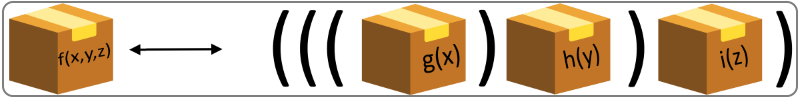

# Curry, Uncurry, Compose

"Currying" predstavlja tehniku koja se koristi za transformisanje funkcije koja ima više argumenata u više poziva funkcija koje imaju jedan ili više argumenata u sebi (najčešće jedan). Naziv je dobila po matematičaru Haskelu Kariju (`Eng. Haskell Curry`).

```python
def dodaj(a, b, c):
    return a + b + c

curry = lambda a: lambda b: lambda c: dodaj(a, b, c)

curry(1)(2)(3)
```
|Output>|`'6'`|
|-------|:-------:|

Ovakav pristup može da bude koristan iz više razloga. Na ovaj način je moguće pojednostaviti pozive funkcija koje prihvataju više argumenata, ukoliko su neki od njih unapred poznati. Takođe je moguće kreirati funkciju koja prihvata manje argumenata iz funkcije koja ih prihvata više.
Još jedna prednost je kombinacija sa drugim funkcijama. Prilagođavanje broja argumenata može da bude korisno kod ulančavanja funkcija.

<p align="center">
  
</p>

Kod koji smo videli u prethodnom primeru, korišćenjem lambda izraza, može da se napiše i korišćenjem metoda. U tom slučaju, kod bi izgledao ovako:

```python
def dodaj(a, b, c):
    return a + b + c

f = dodaj

def g(x):
    def h(y):
        def i(z):
            return f(x, y, z)
        return i
    return h

dodajCurry = g

dodajCurry(1)(2)(3)
```

|Output>|`'6'`|
|-------|:-------:|

Inverzna transformacija se naziva `"Uncurry"`.

```python
def dodaj(x, y, z):
    return x + y + z

curry = lambda x: lambda y: lambda z: dodaj(x, y, z)

uncurry = lambda x, y, z: curry(x)(y)(z)

uncurry(1, 2, 3)
```
|Output>|`'6'`|
|-------|:-------:|

Da se sada upoznamo sa još jednom odlikom Python programskog jezika. Argumenti funkcija, osim što mogu da budu predstavljeni nazivom, razmaknuti zarezom ili kao inicijalizovani argumenti, koji su u startu postavljeni na neku vrednost, mogu da budu predstavljeni i nečime što se zove `starred expression`. Na ovaj način, bilo koju kolekciju je moguće tretirati kao listu argumenata (prostih), dok je dictionary moguće tretirati kao listu inicijalizovanih argumenata. Sintaksa koja omogućava ovu funkcionalnost je sledeća:
1. `*args` ili bilo koji drugi naziv kolekcije je prosta lista argumenata
2. `**kwargs` ili bilo koji drugi naziv dictionary kolekcije je lista inicijalizovanih argumenata

Ukoliko unapred ne znamo koliko argumenata želimo da prosledimo funkciji ili želimo funkciju koja može da prihvati neograničeni broj argumenata, onda je ovo pravi način da se takva funkcionalnost realizuje.

```python
def funkcija(*a, **k):
    print("args: ", a)
    print("kwargs: ", k)

funkcija("Jedan", "Dva", "Tri", first = "Prvi", second = "Drugi")
```
|Output>|`args: ('Jedan', 'Dva', 'Tri')`|
|-------|:-------|
|       |`kwargs: {'first': 'Prvi', 'second': 'Drugi'}`|

##

|Navigacija|
|:-------|
|[Funkcije](Funkcije.md)|
|[Monad](Monad.md)|
|[Memoizacija](Memoizacija.md)|
|[Lambda izrazi](Lambda.md)|
|[Lazy evaluation](Lazy.md)|
|[Curry, Uncurry, Compose](Curry.md)|
|[Python funkcije (min, max, map, filter, zip)](Functions.md)|
|[Biblioteke](Library.md)|
|[functools modul](functools.md)|
|[operator modul](operator.md)|
|[itertools modul](itertools.md)|
|[Comprehensions](Comprehensions.md)|
|[Regularni izrazi](RegularExpressions.md)|
|[Pattern matching](PatternMatching.md)|