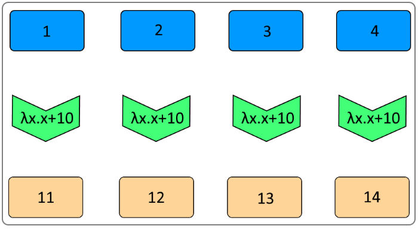
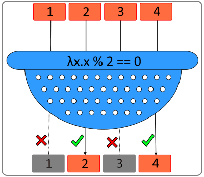
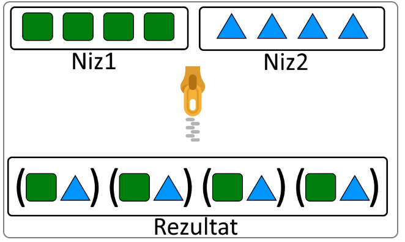

# Python funkcije

## min, max

Metode min i max su slične metodama istog naziva u drugim programskim jezicima. One se koriste za izračunavanje minimuma i maksimuma `n` brojeva. To je i razlika između programskog jezika Python i većine drugih jezika. Broj parametara ovih funkcija nije ograničen.

```python
min(5, 1, 6, 3, 5, 1, 9)
```

|Output>|`'1'`|
|-------|:-------:|

```python
max(5, 1, 6, 3, 5, 1, 9)
```

|Output>|`'9'`|
|-------|:-------:|

Kao što smo ranije videli, Python ima još jednu specifičnost, a to je `starred expression`. Na ovaj način je moguće bilo koju kolekciju proslediti kao listu argumenata ovim funkcijama, iako to nije neophodno, zato što argument može da bude i sama lista.

```python
from random import randint

lista = [randint(1, 100) for _ in range(1, 10)]

print(f"Minimum je: {min(lista)}, dok je maksimum: {max(lista)}")
print(f"Minimum je: {min(*lista)}, dok je maksimum: {max(*lista)}")
```

|Output>|`Minimum je: 4, dok je maksimum: 90`|
|-------|:-------:|
|       |`Minimum je: 4, dok je maksimum: 90`|

## map, filter

Specijalne funkcije, kao što su `map` i `filter` prihvataju kao argument funkciju, kao i listu koju je potrebno obraditi. Ovakav način rada sa kolekcijama je jako intuitivan i jednostavan. Dovoljno je o svakom elementu niza razmišljati kao o jedinom elementu koji je potrebno obraditi korišćenjem funkcije koju pišemo i šaljemo kao argument. Obrada niza se prepušta specijalnoj funkciji, koja našu funkciju izvršava nad svakim elementom niza.

Postoji nekoliko kategorija ovih funkcija, u zavisnosti od ulaznih argumenata i izlazne vrednosti. Funkcije mogu da prihvataju samo jedan niz, ali je moguće da prihvate i više njih. Takođe rezultat može da bude niz iste dužine, kraći niz ili čak broj ili logička vrednost.

Funkcija `map` prihvata niz i vraća niz iste dužine, čiji se svaki element dobija primenom funkcije koju prosleđujemo kao argument.

<p align="center">
  
</p>

```python
list(map(lambda x: x + 10, range(1, 10)))
```

|Output>|`[11, 12, 13, 14, 15, 16, 17, 18, 19]`|
|-------|:-------:|

Funkcija `map` ima povratnu vrednost, koja je tipa `map`. Ovaj tip predstavlja specijalni iterator, čiji naziv čuva informaciju da je dobijen primenom funkcije `map`. Da bi prikazali rezultat u obliku liste, neophodno je da ovaj specijalni tip prvo kastujemo u tip `list`.

Funkcija `filter` je slična funkciji `map`, ali za razliku od nje, izlazni niz je `iste dužine ili kraći` od ulaznog niza. Ovo je posledica funkcije koja se prosleđuje, koja u slučaju funkcije `filter` očekuje `bool` povratnu vrednost, pa se u rezultujućoj kolekciji mogu pronaći elementi koji ovaj uslov zadovoljavaju.

<p align="center">
  
</p>

```python
list(filter(lambda x: not x % 2, range(1, 10)))
```

|Output>|`[2, 4, 6, 8]`|
|-------|:-------:|

Kao i u prethodnom slučaju, funkcija `filter` ima povratnu vrednost tipa `filter`. Ovaj tip je jako sličan tipu `map` i takođe je iteracija. Konverzija u listu se vrši na isti način kao i u prethodnom primeru.

## zip

Funkcija `zip` se koristi za spajanje dve kolekcije. Kolekcije se prosleđuju kroz argumente, a funkcija koja obavlja ovo spajanje se ne prosleđuje, već je uvek ista. Svaki element prve kolekcije, sa elementom druge kolekcije na istom indeksu kreira jedan `tuple` tip u rezultujućem nizu.

Treba napomenuti da ova funkcija ne vrši spajanje elemenata niza koji nemaju odgovarajući par u drugom nizu. Spajanje se vrši do kraće dimenzije oba niza.

<p align="center">
  
</p>

```python
list(zip([1, 2, 3], ["1", "2", "3"]))
```

|Output>|`[(1, '1'), (2, '2'), (3, '3')]`|
|-------|:-------:|

Povratni tip ove funkcije je `zip` iteracija, pa je neophodno, kao i u prethodnim primerima kastovati u listu da bi bila prikazana.

## Funkcije iz Python modula
Uključivanje biblioteka: [Biblioteke](Library.md)

## Modul functools

Postoji više modula koji sadrže funkcije za rad sa kolekcijama. Mi ćemo pomenuti tri ovakva modula. Jedan od njih je `functools`.

Kao što i sam naziv govori, ovo je modul funkcionalnih operatora. Postoji nekoliko funkcija koje će nam biti korisne:
1. reduce
2. cache i lru_cache
3. partial

## reduce

Ovo je funkcija koja se koristi da kolekciju elemenata, koji se prosleđuju kao argument transformiše, korišćenjem funkcije, koja se takođe prosleđuje u rezultat koji nije kolekcija. Funkcija, koja se šalje kao argument, prihvata u ovom slučaju dve vrednosti, a rezultat treba da bude primena operacije nad te dve vrednosti, koju želimo da primenimo nad celom kolekcijom.

```python
from functools import reduce

reduce(lambda x, y: x + y, range(1, 101))
```

|Output>|`5050`|
|-------|:-------:|

Funkcija u prvom prolazu smešta prva dva elementa kolekcije koja se prosleđuje, a zatim se u svakoj sledećoj iteraciji u prvom argumentu nalazi do sada dobijeni rezultat, a u drugom argumentu sledeći element niza. Moguće je proslediti i početnu vrednost i to na ovaj način:

```python
from functools import reduce

reduce(lambda x, y: x + y, range(1, 101), 1000)
```

|Output>|`6050`|
|-------|:-------:|

<p align="center">
  
</p>

Ilustracija na prethodnoj slici prikazuje proceduru množenja kolekcije brojeva od 1 - 4. Primer koji sledi je identičan, uz izmenu gornje granice, koja je sada `10`.

```python
from functools import reduce

reduce(lambda x, y: x * y, range(1, 11), 1)
```

|Output>|`3628800`|
|-------|:-------:|

Rezultat koji na ovaj način dobijamo je zapravo `faktorijel broja 10`.

## Memoizacija (funkcije cache i lru_cache)

Primere za ove dve funkcije možete da pogledate na stranici [Memoizacija](Memoizacija.md)

## partial funkcija

Kada smo govorili o funkcijama `curry, uncurry i compose`, koristili smo metodu `curry` koja nam je omogućavala da funkciju koja prihvata više argumenata transformišemo u funkciju koja vraća drugu funkciju, sve dok broj argumenata ne bude odgovarajući za poziv same funkcije, a tek onda je poziva i vraća vrednost.

Funkcija `partial` koja se nalazi u modulu `functools` nam omogućava sličnu funkcionalnost. Prosleđivanje funkcije koju želimo da transformišemo se vrši korišćenjem prvog argumenta funkcije, a nakon njega može da sledi neograničen broj drugih argumenata, koji će se zapravo tretirati kao argumenti funkcije koju smo prosledili. Na ovaj način je moguće kreirati novu funkciju koja ima `n` manje argumenata, gde `n` može da bude i isti broj argumenata koje naša funkcija prihvata. U tom slučaju je pozivamo bez argumenata.

```python
from functools import partial

def metoda(p, q, r, s):
    print(p, end=", ")
    print(q, end=", ")
    print(r, end=", ")
    print(s, end=".\n")

proba = partial(metoda, 10, 20, 30)
proba(40)

proba = partial(metoda, 10, 20, 30, 40)
proba()

proba = partial(metoda, 10)
proba(20, 30, 40)
proba(20)
```

|Output>|`10, 20, 30, 40.`|
|-------|:----------------|
|       |`10, 20, 30, 40.`|
|       |`10, 20, 30, 40.`|
|       |`TypeError: metoda() missing 2 required positional arguments: 'r' and 's'`|

Kod poslednjeg primera možemo da primetimo i razliku između ove funkcije i `curry`. Ukoliko nemamo dovoljno argumenata, funkcija `partial` nam ne vraća funkciju, koja može da prihvati još argumenata, već nam vraća grešku, koja nam sugeriše da ti argumenti nedostaju.

## operator modul

Ovaj modul sadrži sve matematičke i logičke operatore, kao i operatore `setitem`, `delitem` i `getitem`, koji se koriste za manipulaciju slice objektima (ovi objekti se kreiraju korišćenjem `slice` funkcije). Ovi operatori su implementirani kao funkcije, pa ih je moguće koristiti na taj način. Moguće ih je pozivati sa odgovarajućim argumentima, ali, što je nama još bitnije, prosleđivati drugim funkcijama kada se funkcija očekuje kao argument.

```python
import operator

print(operator.add(10, 20))

tail = slice(1, None)
print(operator.getitem(range(1, 11), tail))

print(operator.getitem(list(range(1, 11)), tail))

print(list(range(1, 11))[tail])
```

|Output>|`30`|
|-------|:-------------|
|       |`range(2, 11)`|
|       |`[2, 3, 4, 5, 6, 7, 8, 9, 10]`|
|       |`[2, 3, 4, 5, 6, 7, 8, 9, 10]`|

```python
from functools import reduce
import operator

print(reduce(operator.add, range(1, 11)))
```

|Output>|`55`|
|-------|:-------------:|

## itertools modul

Ovo je modul koji sadrži funkcije za kreiranje iteratorskih podataka. Postoje 3 kategorije ovih iteratora:
1. Beskonačni operatori
2. Iteratori koji se prekidaju kada se prva kolekcija završi
3. Kombinatorički operatori

U prvu kategoriju spadaju funkcije `count`, `cycle` i funkcija `repeat`.

`count` funkcija se koristi za kreiranje iteracije koja počinje brojem koji je prvi argument funkcije i kreira beskonačno elemenata sa korakom koji je drugi argument.
`cycle` se razlikuje po tome što prihvata kolekciju elemenata, a vraća po jedan od njih. Kada dođe do kraja kolekcije, počinje od početka, zauvek.
`repeat` je slična `cycle` funkciji. Razlika je u tome da prihvata argument bilo kog tipa, a ima i drugi 
argument, kojim je ovu kolekciju moguće ograničiti na konačan broj ponavljanja.

```python
from itertools import *

co = count(1, 2)
cy = cycle([1, 2, 3])
rp = repeat(10, 10)

i = 0

for c in co:
    i += 1
    if i >= 10:
        print(c, end = ".\n")
        break
    print (c, end = ", ")

i = 0

for c in cy:
    i += 1
    if i >= 10:
        print(c, end = ".\n")
        break
    print (c, end = ", ")

print(list(rp))
```

|Output>|`1, 3, 5, 7, 9, 11, 13, 15, 17, 19.`|
|-------|:-------------|
|       |`1, 2, 3, 1, 2, 3, 1, 2, 3, 1.`|
|       |`[10, 10, 10, 10, 10, 10, 10, 10, 10, 10]`|

##

|Navigacija|
|:-------|
|[Funkcije](Funkcije.md)|
|[Monad](Monad.md)|
|[Memoizacija](Memoizacija.md)|
|[Lambda izrazi](Lambda.md)|
|[Lazy evaluation](Lazy.md)|
|[Curry, Uncurry, Compose](Curry.md)|
|[Python funkcije (min, max, map, filter, zip, moduli)](Functions.md)|
|[Biblioteke](Library.md)|
|[Comprehensions](Comprehensions.md)|
|[Regularni izrazi](RegularExpressions.md)|
|[Pattern matching](PatternMatching.md)|