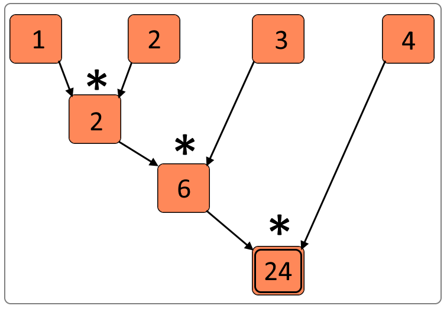

# Python funkcije

## min, max

```
min(iterable [, default=obj, key=func])-> value
min(a, b, *c [, key=func])-> value
max(iterable [, default=obj, key=func])-> value
max(a, b, *c [, key=func])-> value
```

|Parametar|Obavezan|Opis|
|---|---|---|
|Iterable|✅|Kolekcija podataka (string, tuple, lista...)|
|default|❌|Vrednost koju funkcija vraća ukoliko je kolekcija prazna|
|key|❌|Funkcija sa jednim parametrom|

|Parametar|Obavezan|Opis|
|---|--|---|
|a, b, *c|✅|Više parametara (najmanje 2) od kojih se traži minimum ili maksimum|
|key|❌|Funkcija sa jednim parametrom|

Funkcije `min` i `max` prihvataju kolekciju podataka ili više parametara koji se tretiraju kao pojedinačni elementi i vraćaju najmanji/najveći. Parametar kojim se prosleđuje lista elemenata može da bude i prazan. Zato je funkciji koja prihvata kolekciju elemenata moguće proslediti i `default` parametar kojim se prosleđuje vrednost koja se vraća ukoliko je lista prazna. Ukoliko ne koristimo parametar default, prazna kolekcija će vratiti `ValueError`. Parametar `key` prihvata funkciju kojoj se svaki element za poređenje prosleđuje, a upoređivanje se vrši na osnovu vrednosti koju je ona vratila.

```python
min([(6,1),(3,3),(7,2),(2,5)],key=lambdax:x[1])
```

|Output>|`(6, 1)`|
|-------|:-------:|

Funkcije `min` i `max` imaju i drugačiji potpis, koji prihvata listu argumenata koji se porede. Ovakvi elementi takođe mogu biti kolekcije.

```python
max((6,1),(3,3),(7,2),(2,5),key=lambdax:x[1])
```

|Output>|`(6, 1)`|
|-------|:-------:|

```python
min([])
```

|Output>|`ValueError: max() arg is an empty sequence`|
|-------|:-------:|

```python
min([],default=0)
```

|Output>|`0`|
|-------|:-------:|

```python
max(["1234","12","123"],key=len)
```

|Output>|`'1234'`|
|-------|:-------:|

```
sorted(iterable, [key=None, reverse=False]) -> iterable
```

## sorted, sort

Funkcija `sorted` prihvata kolekciju podataka, sortira je i vraća novu listu sortiranu u rastući redosled. Kao i kod funkcija `min` i `max`, moguće je koristiti `key` parametar koji prihvata funkciju sa jednim parametrom. Takođe je moguće proslediti i `reverse` parametar, koji, ukoliko mu je vrednost `True` sortira u opadajući redosled.
Ova metoda je funkcionalna, zato što ne menja prethodnu kolekciju. Postoji i nefukcionalna metoda, `sort`. Potpis joj je identičan, ali se poziva nad objektom koji treba sortirati.

```python
sorted([(6,1),(3,3),(7,2),(2,5)],key=lambdax:x[1])
```

|Output>|`[(6, 1), (7, 2), (3, 3), (2, 5)]`|
|-------|:-------:|

```python
sorted([1,2,3,4,5],reverse=True)
```

|Output>|`[5, 4, 3, 2, 1]`|
|-------|:-------:|

```python
sorted(("Jedan","Dva","Tri","Četiri"),key=len)
```

|Output>|`['Dva', 'Tri', 'Jedan', 'Četiri']`|
|-------|:-------:|

```python
a = [(1,4),(4,2,6),(3,5)]
a.sort(key=lambdax:x[1], reverse=True)
a # vrednost promenjive a je izmenjena
```

## zip

```
zip(iter1 [, iter2 [...]]) -> zip object
```

Funkcija `zip` se koristi za spajanje dve kolekcije. Kolekcije se prosleđuju kroz argumente, a funkcija koja obavlja ovo spajanje se ne prosleđuje, već je uvek ista. Svaki element prve kolekcije, sa elementom druge kolekcije na istom indeksu kreira jedan `tuple` tip u rezultujućem nizu.

Treba napomenuti da ova funkcija ne vrši spajanje elemenata niza koji nemaju odgovarajući par u drugom nizu. Spajanje se vrši do kraće dimenzije oba niza.

<p align="center">
  
</p>

```python
list(zip([1, 2, 3], ["1", "2", "3"]))
```

|Output>|`[(1, '1'), (2, '2'), (3, '3')]`|
|-------|:-------:|

Povratni tip ove funkcije je `zip` iteracija, pa je neophodno, kao i u prethodnim primerima kastovati u listu da bi bila prikazana.

|Output>|`[(3, 5), (1, 4), (4, 2, 6)]`|
|-------|:-------:|

Kao što smo ranije videli, Python ima još jednu specifičnost, a to je `starred expression`. Na ovaj način je moguće bilo koju kolekciju proslediti kao listu argumenata ovim funkcijama, iako to nije neophodno, zato što argument može da bude i sama lista.

```python
from random import randint

lista = [randint(1, 100) for _ in range(1, 10)]

print(f"Minimum je: {min(lista)}, dok je maksimum: {max(lista)}")
print(f"Minimum je: {min(*lista)}, dok je maksimum: {max(*lista)}")
```

|Output>|`Minimum je: 4, dok je maksimum: 90`|
|-------|:-------:|
|       |`Minimum je: 4, dok je maksimum: 90`|

## map, filter

Specijalne funkcije, kao što su `map` i `filter` prihvataju kao argument funkciju, kao i listu koju je potrebno obraditi. Ovakav način rada sa kolekcijama je jako intuitivan i jednostavan. Dovoljno je o svakom elementu niza razmišljati kao o jedinom elementu koji je potrebno obraditi korišćenjem funkcije koju pišemo i šaljemo kao argument. Obrada niza se prepušta specijalnoj funkciji, koja našu funkciju izvršava nad svakim elementom niza.

Postoji nekoliko kategorija ovih funkcija, u zavisnosti od ulaznih argumenata i izlazne vrednosti. Funkcije mogu da prihvataju samo jedan niz, ali je moguće da prihvate i više njih. Takođe rezultat može da bude niz iste dužine, kraći niz ili čak broj ili logička vrednost.

Funkcija `map` prihvata niz i vraća niz iste dužine, čiji se svaki element dobija primenom funkcije koju prosleđujemo kao argument.

<p align="center">
  
</p>

```python
list(map(lambda x: x + 10, range(1, 10)))
```

|Output>|`[11, 12, 13, 14, 15, 16, 17, 18, 19]`|
|-------|:-------:|

Funkcija `map` ima povratnu vrednost, koja je tipa `map`. Ovaj tip predstavlja specijalni iterator, čiji naziv čuva informaciju da je dobijen primenom funkcije `map`. Da bi prikazali rezultat u obliku liste, neophodno je da ovaj specijalni tip prvo kastujemo u tip `list`.

Funkcija `filter` je slična funkciji `map`, ali za razliku od nje, izlazni niz je `iste dužine ili kraći` od ulaznog niza. Ovo je posledica funkcije koja se prosleđuje, koja u slučaju funkcije `filter` očekuje `bool` povratnu vrednost, pa se u rezultujućoj kolekciji mogu pronaći elementi koji ovaj uslov zadovoljavaju.

<p align="center">
  
</p>

```python
list(filter(lambda x: not x % 2, range(1, 10)))
```

|Output>|`[2, 4, 6, 8]`|
|-------|:-------:|

Kao i u prethodnom slučaju, funkcija `filter` ima povratnu vrednost tipa `filter`. Ovaj tip je jako sličan tipu `map` i takođe je iteracija. Konverzija u listu se vrši na isti način kao i u prethodnom primeru.

## Funkcije iz Python modula
Uključivanje biblioteka: [Biblioteke](Library.md)

## Modul functools

Postoji više modula koji sadrže funkcije za rad sa kolekcijama. Mi ćemo pomenuti tri ovakva modula. Jedan od njih je `functools`.

Kao što i sam naziv govori, ovo je modul funkcionalnih operatora. Postoji nekoliko funkcija koje će nam biti korisne:
1. reduce
2. cache i lru_cache
3. partial

## reduce

Ovo je funkcija koja se koristi da kolekciju elemenata, koji se prosleđuju kao argument transformiše, korišćenjem funkcije, koja se takođe prosleđuje u rezultat koji nije kolekcija. Funkcija, koja se šalje kao argument, prihvata u ovom slučaju dve vrednosti, a rezultat treba da bude primena operacije nad te dve vrednosti, koju želimo da primenimo nad celom kolekcijom.

```python
from functools import reduce

reduce(lambda x, y: x + y, range(1, 101))
```

|Output>|`5050`|
|-------|:-------:|

Funkcija u prvom prolazu smešta prva dva elementa kolekcije koja se prosleđuje, a zatim se u svakoj sledećoj iteraciji u prvom argumentu nalazi do sada dobijeni rezultat, a u drugom argumentu sledeći element niza. Moguće je proslediti i početnu vrednost i to na ovaj način:

```python
from functools import reduce

reduce(lambda x, y: x + y, range(1, 101), 1000)
```

|Output>|`6050`|
|-------|:-------:|

<p align="center">
  
</p>

Ilustracija na prethodnoj slici prikazuje proceduru množenja kolekcije brojeva od 1 - 4. Primer koji sledi je identičan, uz izmenu gornje granice, koja je sada `10`.

```python
from functools import reduce

reduce(lambda x, y: x * y, range(1, 11), 1)
```

|Output>|`3628800`|
|-------|:-------:|

Rezultat koji na ovaj način dobijamo je zapravo `faktorijel broja 10`.

## Memoizacija (funkcije cache i lru_cache)

Primere za ove dve funkcije možete da pogledate na stranici [Memoizacija](Memoizacija.md)

## partial funkcija

Kada smo govorili o funkcijama `curry, uncurry i compose`, koristili smo metodu `curry` koja nam je omogućavala da funkciju koja prihvata više argumenata transformišemo u funkciju koja vraća drugu funkciju, sve dok broj argumenata ne bude odgovarajući za poziv same funkcije, a tek onda je poziva i vraća vrednost.

Funkcija `partial` koja se nalazi u modulu `functools` nam omogućava sličnu funkcionalnost. Prosleđivanje funkcije koju želimo da transformišemo se vrši korišćenjem prvog argumenta funkcije, a nakon njega može da sledi neograničen broj drugih argumenata, koji će se zapravo tretirati kao argumenti funkcije koju smo prosledili. Na ovaj način je moguće kreirati novu funkciju koja ima `n` manje argumenata, gde `n` može da bude i isti broj argumenata koje naša funkcija prihvata. U tom slučaju je pozivamo bez argumenata.

```python
from functools import partial

def metoda(p, q, r, s):
    print(p, end=", ")
    print(q, end=", ")
    print(r, end=", ")
    print(s, end=".\n")

proba = partial(metoda, 10, 20, 30)
proba(40)

proba = partial(metoda, 10, 20, 30, 40)
proba()

proba = partial(metoda, 10)
proba(20, 30, 40)
proba(20)
```

|Output>|`10, 20, 30, 40.`|
|-------|:----------------|
|       |`10, 20, 30, 40.`|
|       |`10, 20, 30, 40.`|
|       |`TypeError: metoda() missing 2 required positional arguments: 'r' and 's'`|

Kod poslednjeg primera možemo da primetimo i razliku između ove funkcije i `curry`. Ukoliko nemamo dovoljno argumenata, funkcija `partial` nam ne vraća funkciju, koja može da prihvati još argumenata, već nam vraća grešku, koja nam sugeriše da ti argumenti nedostaju.

## operator modul

Ovaj modul sadrži sve matematičke i logičke operatore, kao i operatore `setitem`, `delitem` i `getitem`, koji se koriste za manipulaciju slice objektima (ovi objekti se kreiraju korišćenjem `slice` funkcije). Ovi operatori su implementirani kao funkcije, pa ih je moguće koristiti na taj način. Moguće ih je pozivati sa odgovarajućim argumentima, ali, što je nama još bitnije, prosleđivati drugim funkcijama kada se funkcija očekuje kao argument.

```python
import operator

print(operator.add(10, 20))

tail = slice(1, None)
print(operator.getitem(range(1, 11), tail))

print(operator.getitem(list(range(1, 11)), tail))

print(list(range(1, 11))[tail])
```

|Output>|`30`|
|-------|:-------------|
|       |`range(2, 11)`|
|       |`[2, 3, 4, 5, 6, 7, 8, 9, 10]`|
|       |`[2, 3, 4, 5, 6, 7, 8, 9, 10]`|

```python
from functools import reduce
import operator

print(reduce(operator.add, range(1, 11)))
```

|Output>|`55`|
|-------|:-------------:|

## itertools modul

Ovo je modul koji sadrži funkcije za kreiranje iteratorskih podataka. Postoje 3 kategorije ovih iteratora:
1. Beskonačni operatori
2. Iteratori koji se prekidaju kada se prva kolekcija završi
3. Kombinatorički operatori

U prvu kategoriju spadaju funkcije `count`, `cycle` i funkcija `repeat`.

`count` funkcija se koristi za kreiranje iteracije koja počinje brojem koji je prvi argument funkcije i kreira beskonačno elemenata sa korakom koji je drugi argument.
`cycle` se razlikuje po tome što prihvata kolekciju elemenata, a vraća po jedan od njih. Kada dođe do kraja kolekcije, počinje od početka, zauvek.
`repeat` je slična `cycle` funkciji. Razlika je u tome da prihvata argument bilo kog tipa, a ima i drugi 
argument, kojim je ovu kolekciju moguće ograničiti na konačan broj ponavljanja.

```python
from itertools import *

co = count(1, 2)
cy = cycle([1, 2, 3])
rp = repeat(10, 10)

i = 0

for c in co:
    i += 1
    if i >= 10:
        print(c, end = ".\n")
        break
    print (c, end = ", ")

i = 0

for c in cy:
    i += 1
    if i >= 10:
        print(c, end = ".\n")
        break
    print (c, end = ", ")

print(list(rp))
```

|Output>|`1, 3, 5, 7, 9, 11, 13, 15, 17, 19.`|
|-------|:-------------|
|       |`1, 2, 3, 1, 2, 3, 1, 2, 3, 1.`|
|       |`[10, 10, 10, 10, 10, 10, 10, 10, 10, 10]`|

Pošto se radi o beskonačnim iteratorima, nemamo mogućnost da prekinemo njihovo izvršenje. Ukoliko bi bilo koji iterator iz ove kategorije, osim rezultata `repeat` funkcije, koja ima drugi argument, kojim se kolekcija kreira do određenog elementa, pretvorili u listu, aplikacija bi se zaustavila i pokušala da kreira beskonačnu kolekciju. To naravno nije dobro rešenje. Pošto se radi o iteratorima koji su osnova za ostale `iterable` tipove koje smo ranije pominjali, takođe ne možemo da koristimo indeksiranje ili `slice` funkciju. Zato je jedino rešenje da prekinemo sa korišćenjem iteratora (`for petlja` u ovom slučaju, mada smo mogli da koristimo i sami `next` funkciju nad samim iteratorom), a samim tim, novi elementi se dalje neće kreirati.

Iteratori koji se prekiraju kada se prva kolekcija završi

Funkcije koje spadaju u ovu kategoriju iteratora mogu da se koriste za različite operacije nad kolekcijama podataka. Obradićemo najbitnije funkcije iz ove kategorije.

- `accumulate` funkcija

```python
from itertools import *

print(list(accumulate(range(1, 11), lambda x, y: x * y, initial = 1)))
```

|Output>|`[1, 1, 2, 6, 24, 120, 720, 5040, 40320, 362880, 3628800]`|
|-------|:-------------|

Ova funkcija je slična `reduce` funkciji, ali za razliku od nje, ona vraća kolekciju svih elemenata kolekcije koja je obrađena. Na odgovarajućim mestima u ovoj kolekciji se nalaze vrednosti koje su izračunate u koraku koji tom indeksu odgovara.

- `chain` funkcija

```python
from itertools import *

print(list(chain("ABC", "DEF")))
```

|Output>|`['A', 'B', 'C', 'D', 'E', 'F']`|
|-------|:-------------|

`chain` funkcija prihvata dve kolekcije (u ovom slučaju kolekcije karaktera, string), koje objedinjuje u jednu. Prva kolekcija se nalazi na prvim indeksima u rezultujućoj kolekciji, dok se na ostala mesta upisuje druga kolekcija.

- `compress` funkcija

```python
from itertools import *

print(list(compress("ABCDEF", [1, 1, 0, 1, 0, 1])))
```

|Output>|`['A', 'B', 'D', 'F']`|
|-------|:-------------|

Ova funkcija može da nam pomogne da iz kolekcije izvučemo samo odgovarajuće elemente, ukoliko znamo na kojim se pozicijama nalaze. Drugi argument je kolekcija koja se tretira kao kolekcija logičkih vrednosti. Elementi koji se prepisuju iz ulazne kolekcije su oni koji na istom indeksu u ovoj kolekciji imaju vrednost koju Python tretira kao `True` vrednost.

- `dropwhile` funkcija

```python
from itertools import *

print(list(dropwhile(lambda x: x < 5 or x > 7, range(1, 11))))
```

|Output>|`[5, 6, 7, 8, 9, 10]`|
|-------|:-------------|

Funkcija, koja se prosleđuje kao prvi argument, treba da vraća `bool` tip podataka. Svi elementi do prve `False` vrednosti ove funkcije će biti izbačeni iz rezultujuće kolekcije.

- `filterfalse` funkcija

```python
from itertools import *

print(list(filterfalse(lambda x: x < 5 or x > 7, range(1, 11))))
```

|Output>|`[5, 6, 7]`|
|-------|:-------------|

Za razliku od prethodne funkcije, ova funkcija u rezultujuću kolekciju smešta samo elemente za koje je prosleđena funkcija vratila vrednost `False`.

- `groupby` funkcija

```python
from itertools import *

for k, g in groupby("AAAABBBCCDAABBB"):
    print((k, len(list(g))), end = " ")

for k, g in groupby("AABBCC"):
    print((k, list(g)), end = " ")
```

|Output>|`('A', 4) ('B', 3) ('C', 2) ('D', 1) ('A', 2) ('B', 3)`|
|-------|:-------------|
|       |`('A', ['A', 'A']) ('B', ['B', 'B']) ('C', ['C', 'C'])`|

Funkcija `groupby` grupiše elemente kolekcije koja je prosleđena, kreirajući specijalnu kolekciju, nalik na rečnik. Ukoliko ovu kolekciju posmatramo kao `tuple`, možemo da je "otpakujemo" korišćenjem sintakse u primeru iznad.

- `islice` funkcija

```python
from itertools import *

print(list(islice("ABCDEF", 1, 4, 2)))  # from, count, step
```

|Output>|`['B', 'D']`|
|-------|:-------------|

Funkcija koja je slična `slice` funkciji. Način korišćenja je drugačiji. Ova funkcija prihvata samu kolekciju, indeks od koga rezultujuća kolekcija treba da počne, broj elemenata (ukoliko ih ima tolko) koje treba preuzeti, kao i preskok.

- `pairwise` funkcija

```python
from itertools import *

print(list(pairwise("ABCDE")))
```

|Output>|`[('A', 'B'), ('B', 'C'), ('C', 'D'), ('D', 'E')]`|
|-------|:-------------|

`pairwise` funkciju možemo da koristimo kada nam je potrebno da pronađemo svaki par susednih elemenata u nekoj kolekciji podataka.

- `starmap` funkcija

```python
from itertools import *

print(list(starmap(lambda x, y: x ** y, pairwise(range(1, 5)))))
```

|Output>|`[1, 8, 81]`|
|-------|:-------------|

`starmap` nam omogućava da nad kolekcijom `tuple` podataka izvršimo bilo koju operaciju, koju možemo da prosledimo kao prvi argument funkcije.

- `takewhile` funkcija

```python
from itertools import *

print(list(takewhile(lambda x: x < 50, count(10, 5))))
```

|Output>|`[10, 15, 20, 25, 30, 35, 40, 45]`|
|-------|:-------------|

Funkcija `takewhile` je slična funkcijama `dropwhile` i `filterfalse`. Za razliku od njih, ona preuzima elemente iz kolekcije (iteracije) koji ispunjavaju uslov iz funkcije koja se prosleđuje.

Takođe na ovom primeru možemo da vidimo još jedan način prekidanja beskonačnih kolekcija, kao što je to kolekcija koju kreira `count` funkcija.

- `tee` funkcija

```python
from itertools import *

for t in tee(range(1, 11), 2):
    print(list(t))
```

|Output>|`[1, 2, 3, 4, 5, 6, 7, 8, 9, 10]`|
|-------|:-------------|
|       ||`[1, 2, 3, 4, 5, 6, 7, 8, 9, 10]`|

Ukoliko imamo iteraciju, koju želimo da replikujemo u `n` primeraka, `tee` je funkcija koja to može da nam uradi. Svaka od iteracija koje ova funkcija vraća je duplikat prosleđene, ali one nisu zavisne. To znači da ukoliko prvu kolekciju pomerimo za jedno mesto, druga će još uvek biti na početnom elementu.

- `zip_longest` funkcija

```python
from itertools import *

print(list(zip_longest('1234', [1, 2], fillvalue='-')))
```

|Output>|`[('1', 1), ('2', 2), ('3', '-'), ('4', '-')]`|
|-------|:-------------|

Ova funkcija je slična `zip` funkciji. Razlika je u tome što `zip` funkcija prekida spajanje elemenata kada bilo koja od dve kolekcije nema više elemenata. `zip_longest` se razlikuje, zato što joj je moguće proslediti argument `fillvalue` koji se koristi da na nedostajuće pozicije upisuše tu vrednost.

Kombinatorički iteratori

- `product` funkcija

```python
from itertools import *

print(list(product("AB", "CD")))
```

|Output>|`[('A', 'C'), ('A', 'D'), ('B', 'C'), ('B', 'D')]`|
|-------|:-------------|

Dekartov proizvod kolekcije koja se tretira kao skup.

- `permutations` funkcija

```python
from itertools import *

print(list(permutations("ABC", 2)))
```

|Output>|`[('A', 'B'), ('A', 'C'), ('B', 'A'), ('B', 'C'), ('C', 'A'), ('C', 'B')]`|
|-------|:-------------|

Kao što i sam naziv govori, ovo je funkcija koja određuje sve permutacije nad skupom koji je prosleđen. Permutacije su dužine koja je prosleđena kao drugi argument.

- `combinations` funkcija

```python
from itertools import *

print(list(combinations("ABCD", 2)))
```

|Output>|`[('A', 'B'), ('A', 'C'), ('A', 'D'), ('B', 'C'), ('B', 'D'), ('C', 'D')]`|
|-------|:-------------|

Funkcija `combinations` vraća sve kombinacije skupa koji je prosleđen kao prvi argument. Drugi argument je dužina kombinacija. Svaka kolekcija koja se prosledi kombinatoričkim funkcijama se tretira kao skup.

- `combinations_with_replacement` funkcija

```python
from itertools import *

print(list(combinations_with_replacement("ABC", 2)))
```

|Output>|`[('A', 'A'), ('A', 'B'), ('A', 'C'), ('B', 'B'), ('B', 'C'), ('C', 'C')]`|
|-------|:-------------|

Poslednja funkcija u ovoj kategoriji je `combinations_with_replacement`. Ona nam vraća sve kombinacije dužine koja je prosleđena kao drugi argument, nad kolekcijom koja predstavlja prvi argument, `sa ponavljanjima`.

##

|Navigacija|
|:-------|
|[Funkcije](Funkcije.md)|
|[Monad](Monad.md)|
|[Memoizacija](Memoizacija.md)|
|[Lambda izrazi](Lambda.md)|
|[Lazy evaluation](Lazy.md)|
|[Curry, Uncurry, Compose](Curry.md)|
|[Python funkcije (min, max, map, filter, zip, moduli)](Functions.md)|
|[Biblioteke](Library.md)|
|[Comprehensions](Comprehensions.md)|
|[Regularni izrazi](RegularExpressions.md)|
|[Pattern matching](PatternMatching.md)|
