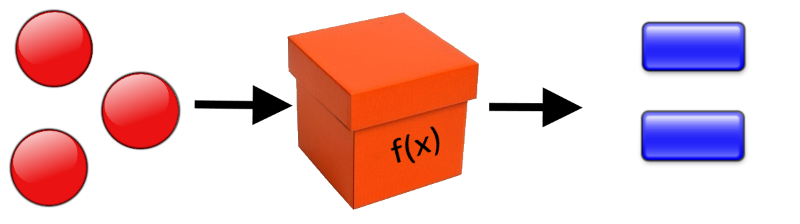

# Funkcije

<p align="center">
  
</p>

Funkcionalno programiranje nije osnovna paradigma programiranja u Python programskom jeziku, zato što je on prvenstveno objektno-orijentisan jezik. Ipak, on ima podršku za rad sa velikim brojem funkcionalnih koncepata, kao što su lambda izrazi, pretraga po šablonima (pattern matching), funkcije prve klase, funkcije višeg reda i čiste funkcije.
Funkcionalno programiranje ima svoje prednosti i mane.

Neke od prednosti su:
+ Apstrakcija
+ Jednostavno debagiranje i prepravke koda
+ Jednostavna paralelizacija

Najveće mane predstavljaju:

- Input/Output sistem, koji ne može da se implementira na funkcionalan način
- Rekurzija, koja je uglavnom sporija od korišćenja iteracija
- Stanje, koje je teško pratiti, zato što se prenosi sa izlaza jedne na ulaz druge funkcije

# Rekurzija

<p align="center">
  
</p>

Postoji više vrsta rekurzije i ona se može podeliti na više načina.
Prvi način je podela po mestu na kome se rekurzivni poziv nalazi:
 - Primitivna rekurzija (rekurzija glave) - `Eng. Head Recursion`
   - Rekurzivni poziv je prvi poziv u funkciji i rezultat ovog rekurzivnog poziva se koristi u daljoj evaluaciji
 - Repna rekurzija - `Eng. Tail Recursion`
   - Rekurzivni poziv je poslednji poziv u funkciji i zavisi od ostalih izraza koji se evaluiraju ranije. Ova vrsta rekurzije se efikasno optimizuje u funkcionalnim jezicima. Nažalost, Python nema mogućnost automatske optimizacije repne rekurzije. Međutim, postoje biblioteke koje mogu da omoguće ovu optimizaciju.

Primer rekurzije glave (head recursion):

```python
# Verzija sa rekurzijom glave (head recursion)

# Bez obzira gde se rekurzivni poziv nalazi (ispred ili iza * n) on mora da bude izvršen pre nego što možemo da znamo vrednost izraza, tako da se u ovom slučaju radi o rekurziji glave
```

```python
def factorial(n):
    if n == 0:
        return 1
    else:
        return factorial(n - 1) * n
```

Primer rekurzije repa (tail recursion)

```python
# Verzija sa repnom rekurzijom (tail recursion, bez optimizacije)

# acc * n mora da bude određeno pre nego što dođe do rekurzivnog poziva, tako da se radi o rekurziji repa
```

```python
def factorialRR(n, acc = 1):
    if n == 0:
        return acc
    else:
        return factorialRR(n - 1, acc * n)
```

Druga vrsta podele rekurzije je po broju rekurzivnih poziva u funkciji i može biti:
 - Jednostruka rekurzija
   - Rekurzija kod koje postoji samo jedan rekurzivni poziv u funkciji
   - Primer: Funkcija za računanje faktorijela broja, rekurzivno sabiranje niza brojeva...
 - Višestruka rekurzija
   - Postoji više rekurzivnih poziva unutar funkcije 
   - Primer: Funcija za računanje elemenata Fibonačijevog niza, problem Hanojskih kula...
 - Indirektna rekurzija
   - Rekurzija kod koje se 2 ili više funkcija naizmenično pozivaju jedna iz druge
   - Primer: Funkcija za obilazak datoteka u direktorijumu (jedna funkcija obilazi hijerarhiju direktorijuma, a druga fajlove u njima)...

Uključivanje biblioteka možete naći na [Biblioteke](Library.md)

Ukoliko uključimo biblioteku `tail-recursive` sa `Python Package Index`-a, možemo da koristimo funkciju `tail_recursive` iz ove biblioteke da bi simulirali repnu rekurziju u programskom jeziku Python.

```python
from tail_recursive import tail_recursive

@tail_recursive
def factorial(n):
    if n == 0:
        return 1
    return n * factorial.tail_call(n - 1)   # Modifikacija koju je neophodno izvršiti

# factorial funkcija je napisana korišćenjem rekurzije glave, ali
# i dalje ne dolazi do stack overflow exception-a
print(factorial(1000))
```

|Output>|`402387260077093773543702433923003985719374864...`|
|-------|:-------:|

Ukoliko želimo da koristimo rekurziju glave, svakako neće dolaziti do `stack overflow exception`-a kao i u prethodnom primeru, ali će kod biti nešto brži, zato što ima manje operacija koje treba izvršiti (množenje).

```python
from tail_recursive import tail_recursive

@tail_recursive
def factorialRR(n, acc = 1):
    if n == 0:
        return acc
    return factorialRR.tail_call(n - 1, acc * n)

print(factorialRR(1000))
```

|Output>|`402387260077093773543702433923003985719374864...`|
|-------|:-------:|

Rezultat je naravno isti.

Funkcije prve klase su podržane u programskom jeziku Python. Sve funkcije su funkcije prve klase. To podrazumeva:
 1. Da je moguće slanje funkcija kao argumenata u druge funkcije
 2. Vraćanje funkcije kao rezultata iz druge funkcije je takođe moguće
 3. Kao i dodeljivanje funkcija promenjivama, menjanje imena funkcija kao i kopiranje funkcija u druge promenjive

Primer:

```python
print.__qualname__
```

|Output>|`'print'`|
|-------|:-------:|

```python
stampaj = print
stampaj.__qualname__
```

|Output>|`'print'`|
|-------|:-------:|

```python
stampaj("Poruka")
```

|Output>|`Poruka`|
|-------|:------:|

Funkcije višeg reda su funkcije koje prihvataju druge funkcije kao argument i vraćaju funkciju kao rezultat. Kao što se vidi u prethodnoj listi, ovo je posledica koja proizilazi iz 1. i 2. pravila funkcija prve klase, pa se zato kaže da funkcije višeg reda postoje zahvaljujući funkcijama prve klase.

Postojanje funkcija prve klase zahteva postojanje funkcija višeg reda, ali obrnuto ne važi.

Čiste funkcije su funkcije koje ne proizvode nikakve posledice, ne menjajući stanja izvan samog tela funkcije, već mogu da menjaju samo lokalne promenjive, a komunikaciju sa drugim funkcijama vrše putem argumenata i povratne vrednosti, kojom se šalje rezultat. Ovi argumenti takođe ne smeju da budu promenjeni.

Korišćenje čistih funkcija je jako bitno zato što omogućava bezbedno izvršavanje konkurentnog koda kod paralelnog programiranja, ali i zato što omogućava lakše pisanje funkcija i debagiranje. Greške u izvršenju su svedene na minimum, a jednostavno je pratiti tok izvršenja.

##

|Navigacija|
|:-------|
|[Funkcije](Funkcije.md)|
|[Monad](Monad.md)|
|[Memoizacija](Memoizacija.md)|
|[Lambda izrazi](Lambda.md)|
|[Lazy evaluation](Lazy.md)|
|[Curry, Uncurry, Compose](Curry.md)|
|[Python funkcije (min, max, map, filter, zip, moduli)](Functions.md)|
|[Biblioteke](Library.md)|
|[Comprehensions](Comprehensions.md)|
|[Regularni izrazi](RegularExpressions.md)|
|[Pattern matching](PatternMatching.md)|