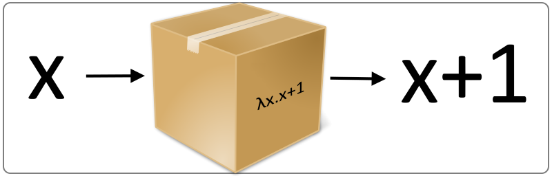

# Lambda izrazi (Lambda expressions)

<p align="center">
  
</p>

Lambda izrazi u funkcionalnim programskim jezicima su koncept koji je pozajmljen iz matematike. Koncept je nastao 1930. godine i uveden je u matematiku zahvaljujući matematičaru Alonzo Čerču (`Eng. Alonzo Church`). Sredinom prošlog veka, veliki broj istraživanja u ovoj oblasti omogućio je da se uvidi korisnost ovog pristupa u računarstvu, pa je još tada nastala ideja da ovaj model može da bude korišćen za simuliranje Turingovih mašina.

Kreiranje lambda izraza je slično kreiranju funkcije, mada se u ovom slučaju radi o jednostavnom izrazu (`Eng. expression`). Izraz, koji se u programskom jeziku Python kreira korišćenjem `lambda` ključne reči, i dalje se koristi kao bilo koja druga funkcija, u kombinaciji sa argumentima koji mu pripadaju. Ovo je ujedno i jedan od najjednostavnijih načina da se u programskom jeziku Python napiše prosta funkcija, gde sama sintaksa koja se koristi, programera navodi na kreiranje čiste funkcije, zato što je kod lambda izraza prirodno da se globalne promenjive ne koriste.

To možemo da vidimo na nekoliko prostih primera.

```python
kvadratLambda = lambda x: x ** 2
kvadratLambda(10)
```

|Output>|`100`|
|-------|:-------:|

Ekvivalentna funkcija napisana tradicionalnom Python sintaksom bi izgledala ovako:

```python
def kvadratFunc(x):
    return x ** 2

kvadratFunc(10)
```

|Output>|`100`|
|-------|:-------:|

Ukoliko želimo da naš lambda izraz ima više od jednog argumenta, to možemo da napišemo na sledeći način:

```python
addLambda = lambda x, y: x + y
addLambda(10, 20)
```

|Output>|`30`|
|-------|:-------:|

Ili ukoliko ne želimo da ovaj lambda izraz smeštamo u promenjivu, nego želimo da ga pozovemo samo jednom, onda bismo napisali ovakav kod, koji nas naravno dovodi do istog rešenja:

```python
(lambda x, y: x + y)(10, 20)
```

|Output>|`30`|
|-------|:-------:|

Ekvivalent ovog lambda izraza bi naravno bio sledeća funkcija:

```python
def addFunc(x, y):
    return x + y

addFunc(10, 20)
```

|Output>|`30`|
|-------|:-------:|

Iako lambda izrazi mogu da se sastoje od samo jednog izraza, ovaj izraz ne mora da bude napisan u jednoj liniji koda, ukoliko se koriste zagrade. U tom slučaju, početak izraza se nalazi kod otvorene zagrade, a kraj, kod odgovarajuće zatvorene zagrade. Ovo može da nam bude korisno ukoliko želimo da napišemo nešto složeniji izraz, koji, osim što ima prostu operaciju, može da ima i ternarni uslovni operator, što možemo videti u sledećem primeru.

```python
(lambda x: 
    (x if x % 2 == 0 else "Neparan broj"))(2)
```

|Output>|`2`|
|-------|:-------:|

```python
(lambda x: 
    (x if x % 2 == 0 else "Neparan broj"))(3)
```

|Output>|`'Neparan broj'`|
|-------|:-------:|

Osim što vidimo primenu ternarnog operatora u kodu iznad, uz pomoć uslova (`if` i `else` grane koja nam vraća drugi podatak ukoliko uslov nije ispunjen), možemo da vidimo i da povratni tip ne mora da bude isti u svim slučajevima. U primeru iznad, kod može da nam vrati `int` podatak ukoliko se radi o ispunjenom uslovu, ali `str` podatak ukoliko uslov nije ispunjen. To se poklapa sa našim dosadašnjim znanjem o Python programskom jeziku, gde tipovi nisu strogi i moguće ih je koristiti u različitim kombinacijama.

Na sledećem primeru ćemo takođe obratiti pažnju na jednu osobinu Python programskog jezika, a to je osobina `Boolean` podataka da bilo koji tip može da se posmatra kao da se radi o logičkom.

```python
(lambda x: not (x % 2) and "Paran" or "Neparan")(8)
```

|Output>|`'Paran'`|
|-------|:-------:|

```python
(lambda x: not (x % 2) and "Paran" or "Neparan")(9)
```

|Output>|`'Neparan'`|
|-------|:-------:|

Za početak, izraz `x % 2` se posmatra kao `bool` podatak, pa, pošto se radi o `int` tipu, on će biti ispunjen u svakom slučaju kada je njegova vrednost `!= 0`. To znači da svaki broj koji nije paran, će biti `True`, dok će svaki paran broj imati vrednost `False`. Zato koristimo `not` ključnu reč, koja će da nam promeni vrednost ove `bool` vrednosti, zato što mi želimo da znamo da li je broj paran. Takođe smo mogli i da zamenimo mesta string-ovima nakon uslova, ali smo se ipak odlučili za ovaj pristup.

Nakon što znamo da li je broj paran ili ne, dolazimo do jedne od dve potencijalno moguće situacije.
1. Ukoliko je `not (x % 2) == True` onda želimo da znamo da li je vrednost nakon ključne reči `and` takođe `True`. Python, kao i većina drugih programskih jezika, izraze izvršava sa leve na desnu stranu, kao što bismo to uradili i matematički, pa nam je bitno šta sledi nakon ključne reči `and`.
   - Vrednost literala `"Paran"` je uvek `True`, zato što svaki string koji nije prazan ima tu vrednost, pa onda znamo i bez potrebe da proveravamo vrednost onoga što sledi nakon ključne reči `or` da je celokupan izraz `True`.
2. Ukoliko je vrednost za `not (x % 2) == False`, onda nam vrednost literala nakon ključne reči `and` ne igra nikakvu ulogu u izračunavanju vrednosti izraza, pa prelazimo na deo nakon ključne reči `or`, zato što od nje zavisi da li će celokupna vrednost izraza biti `True` ili `False`. Zato je vrednost izraza ista kao i vrednost literala `Neparan`, što je i u ovom slučaju `True`.

Konačno, još jedna odlika Python programskog jezika je da se vrednost za Boolean izraz ne vraća kao literal `True` ili `False`, već se vraća vrednost od koje sama vrednost izraza zavisi. U oba slučaja, to je literal koji je nakon ključnih reči `and` ili `or`. Zato će se ova vrednost i vratiti.

##

|Navigacija|
|:-------|
|[Funkcije](Funkcije.md)|
|[Monad](Monad.md)|
|[Memoizacija](Memoizacija.md)|
|[Lambda izrazi](Lambda.md)|
|[Lazy evaluation](Lazy.md)|
|[Curry, Uncurry, Compose](Curry.md)|
|[Python funkcije (min, max, map, filter, zip, moduli)](Functions.md)|
|[Biblioteke](Library.md)|
|[Comprehensions](Comprehensions.md)|
|[Regularni izrazi](RegularExpressions.md)|
|[Pattern matching](PatternMatching.md)|