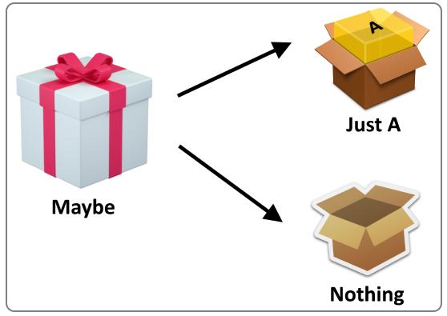

# Monad

<p align="center">
  
</p>

Funkciju koja je čista jednostavno je izmeniti tako da se u nju uvedu posledice. Da bi se zadržala čista funkcija, ona mora da sve ulazne podatke dobija preko argumenata i da joj jedini rezultat bude povratni podatak (iako on može da ima više od jednog podatka u sebi, tuple, list...).

Print naredba je najlakši način da se ovo uradi. Korišćenjem print naredbe (IO), funkcija gubi svoj status čiste funkcije.

Da bi se ovo izbeglo moguće je da se print naredba ne koristi unutar same funkcije, već da se funkcija koristi da se izvrši "izračunavanje", a da se onda podatak vrati na štampanje izvan funkcije, putem povratne vrednosti, kao što je i bio prosleđen (putem argumenta).

Na ovaj način, funkcija ostaje čista, ali se neke njene funkcionalnosti onemogućavaju. Ukoliko je ona imala jedan argument i kao povratni tip je imala jedan podatak istog tipa, na ovaj način je bilo moguće rezultat prethodnog poziva funkcije proslediti na ulaz sledećeg poziva. Nakon što je broj podataka u povratnom tipu promenjen, ovo je onemogućeno.

Rešenje ovog problema predstavlja monad. Monad predstavljaju 2 funkcije, `unit` i `bind` funkcija. One omogućavaju da se ulazni podatak transformiše u argument koji funkcija može da prihvati (u zavisnosti od konkretnog problema) (funkcija `unit`) i da se funkcija koju treba izvršiti prihvati kao argument, kao i podaci koje treba koristiti za izvršenje funkcije (funkcija `bind`).

Ovo ćemo najlakše videti na jednom prostom primeru. Zamislimo da nam je potrebna čista funkcija koja treba da nam kvadrira broj. Ova funkcija treba da prihvata broj, a da ima rezultat koji je kvadrirani broj. Nju bi mogli da realizujemo na sledeći način:

```python
def kvadrat(x):
    return x ** 2
```

Ovako napisana prosta funkcija je i čista funkcija, zato što nema pristupanja ili izmene promenjivih koje su van konteksta same funkcije, kao ni poziva funkcija koje zavise od deljenih resursa računara. Međutim, to je jako jednostavno promeniti. Nakon određenog vremena, shvatili smo da je neophodno da imamo sličnu funkciju, ali da nam je iz nekog razloga potreban i podatak o samom broju koji smo kvadrirali. Ovo je takođe jednostavna izmena, zar ne?

```python
def kvadratP(x):
    print ("Broj za kvadriranje je " + str(x))
    return x ** 2
```

Ovim smo rešili problem ispisivanja broja, na jako lak način. Ali, osim što smo dobili funkcionalnost koju smo želeli, dobili smo i **posledicu!** Ona se ogleda u korišćenju IO operacije print, koja zavisi od standardnog izlaza računara, a samim tim, moguće je da dođe i do **konflikta prilikom pristupa ovom resursu**.

Da bi funkcija i dalje ostala čista, moramo da promenimo ovaj kod na taj način što ćemo print naredbu da izbacimo iz tela funkcije. To možemo da učinimo na taj način što ćemo da iz funkcije, osim samog kvadriranog broja, vratimo i broj koji je prosleđen kao argument.

```python
def kvadratPP(x: int) -> (int, str):
    broj = "Broj: " + str(x)
    return (x ** 2, broj) 
```

Anotacije koje možemo da vidimo u kodu iznad, ne govore funkciji da ona **mora** da prihvati samo `int` tip i vrati tuple `(int, str)`. Ova anotacija se koristi samo da bi programeru sugerisala na to koji tip je poželjan kao argument i šta može da očekuje na izlazu iz funkcije. Ona može da bude pročitana korišćenjem sledećeg koda:

```python
kvadratPP.__annotations__
```

|Output>|`{'x': <class 'int'>, 'return': (<class 'int'>, <class 'str'>)}`|
|-------|:-------:|

Na ovaj način možemo da pročitamo informacije o argumentima (`x` u ovom slučaju) i `return` vrednosti, kroz podatak tipa `dict` koji nam je atribut `__annotation__` vratio.

Da se vratimo na funkciju. Ona sada može da prihvati isti argument kao i ranije, ali ima drugačiju povratnu vrednost. Ovo može da bude problem ukoliko pokušamo da je pozovemo više puta nad prethodno izračunatim rezultatom.

```python
kvadratPP(kvadratPP(10))
```

|Output>|`TypeError: unsupported operand type(s) for ** or pow(): 'tuple' and 'int'`|
|-------|:-------:|

Funkcija `**` (`pow`) očekuje podatak koji je broj, na mestu broja koji treba da se kvadrira, kao i na mestu stepena. To u ovom slučaju nije tako, zato što naša funkcija vraća `tuple` tip podataka, pa je njega nemoguće kastovati u tip `int`.

Rešenje ovog problema može da bude kombinovanje ove funkcije.

```python
def kombinacijaFunkcija(drugaFja, prvaFja, broj: int):
    prviRez = prvaFja(broj)
    drugiRez = drugaFja(prviRez[0])
    return (drugiRez[0], prviRez[1] + ", " + drugiRez[1])
```

```python
kombinacijaFunkcija(kvadratPP, kvadratPP, 2)
```

|Output>|`(16, 'Broj: 2, Broj: 4')`|
|-------|:-------:|

Rezultat je sada broj koji je dobijen dvostrukim kvadriranjem broja 2, kao i string koji predstavlja brojeve koji su prosleđivani kao argument u svim prethodnim i konačnom pozivu funkcije `kvadratPP`.

Ovo je dobro rešenje, čime je zadržana čistoća funkcije, kao i podatak o svakoj vrednosti kroz koju je naš broj prošao, da bi došao do konačnog rešenja. Ali se javlja još jedan problem. Šta ukoliko želimo da ovu funkciju pozovemo na identičan način, ulančavanjem, neograničen broj puta. To je trenutak kada na scenu stupa monad.

Funkcije `unit` i `bind` (koje naravno mogu da imaju i drugi naziv, ali smo odlučili da ih tako zovemo), treba da nam reše problem, od prvog poziva, pa sve do poslednjeg.

Krenućemo od funkcije `bind`, zato što je to funkcija koja će obavljati funkcionalnost koju tražimo. Ova funkcija treba da prihvati našu originalnu funkciju, kao i argument nad kojim treba odrediti sledeću vrednost i da nam vrati rezultat u formatu koji očekujemo (broj koji je dobijen ovom operacijom i string koji sadrži sve prethodne vrednosti argumenta).

```python
def bind(fja, prethodni: (int, str)):
    rez = fja(prethodni[0])
    return (rez[0], prethodni[1] +
        (", " if prethodni[1] else "") +
            rez[1])
```

Ova funkcija treba da iz liste argumenata (koja je prosleđena kao tuple podatak `prethodni`), izvuče samo prvi podatak (prethodnu kvadriranu vrednost) i prosledi je funkciji. Naša funkcija (`kvadratPP`) treba da bude prosleđena kao prvi argument.

Nakon izvršenja ove funkcije, `rez` lokalna promenjiva u sebi ima tuple podatak sa novodobijenim brojem i stringom koji sada obuhvata i poslednji broj. Zato je neophodno da prvi podatak iz `rez` promenjive vratimo na prvom mestu novog tuple podatka koji vraćamo, a da string, koji predstavlja drugi podatak koji funkcija treba da vrati dobijemo nadovezivanjem prethodnog stringa, koji sadrži sve brojeve do prethodnog poziva funkcije, sa novim, koji se nalazi u `rez[1]`. Izraz koji sadrži `if` i `else` u liniji ispod `return` nam služi da proveri da li je prethodni string bio prazan. Ukoliko jeste, dolazi se do `else` grane, pa se na početak stringa neće upisati zarez. Ukoliko je uslov ispunjen (ako `prethodni[1]` nije prazan), onda se upisuje zarez, koji razdvaja prethodni i sledeći broj.

Ovu funkciju bi mogli da pozovemo i ulančamo neograničeni broj puta. Jedini problem je podatak koji se šalje na početku. Funkcija očekuje tuple, ali mi želimo da zadržimo funkcionalnost istu kao i kod funkcije `kvadratPP` i prosledimo joj broj.

Tim problemom treba da se pozabavi funkcija `unit`. Ona je zadužena da broj transformiše u oblik koji naša funkcija bind razume (tuple od broja i string-a koji će pri prvom pozivu biti prazan).

```python
def unit(broj: int):
    return (broj, "")
```

Sada našu funkciju `kvadratPP` možemo da pozovemo neograničen broj puta, ulančanu, putem funkcija `unit` i `bind`.

```python
print(bind(kvadratPP,
      bind(kvadratPP,
      bind(kvadratPP,
         unit(2)))))
```

|Output>|`(256, 'Broj: 2, Broj: 4, Broj: 16')`|
|-------|:-------:|

Ostaje još jedan problem. A to je nepreglednost ovog poziva. Da li je moguće olakšati pozivanje funkcije `bind`, da bi celokupno ulančavanje bilo preglednije?

Rešenje je naravno korišćenje lambda izraza. Naravno, moguće je napisati i identičnu metodu, ali je ipak jednostavnije korišćenje lambda izraza.

```python
kvadrat = lambda x: bind(kvadratPP, x)
kvadrat(kvadrat(kvadrat(unit(2))))
```

|Output>|`(256, 'Broj: 2, Broj: 4, Broj: 16')`|
|-------|:-------:|

Ili čak možda i jednostavnije, korišćenjem funkcije koja našu funkciju izvršava `n` puta.

```python
kvadrat = lambda x: bind(kvadratPP, x)

def kvadratN(n: int, brKoraka: int) -> (int, str):
    k = unit(n)
    for _ in range(0, brKoraka):
        k = kvadrat(k)
    return k

kvadratN(2, 4)
```

|Output>|`(65536, 'Broj: 2, Broj: 4, Broj: 16, Broj: 256')`|
|-------|:-------:|

##

|Navigacija|
|:-------|
|[Funkcije](Funkcije.md)|
|[Monad](Monad.md)|
|[Memoizacija](Memoizacija.md)|
|[Lambda izrazi](Lambda.md)|
|[Lazy evaluation](Lazy.md)|
|[Curry, Uncurry, Compose](Curry.md)|
|[Python funkcije (min, max, map, filter, zip)](Functions.md)|
|[Biblioteke](Library.md)|
|[functools modul](functools.md)|
|[operator modul](operator.md)|
|[itertools modul](itertools.md)|
|[Comprehensions](Comprehensions.md)|
|[Regularni izrazi](RegularExpressions.md)|
|[Pattern matching](PatternMatching.md)|